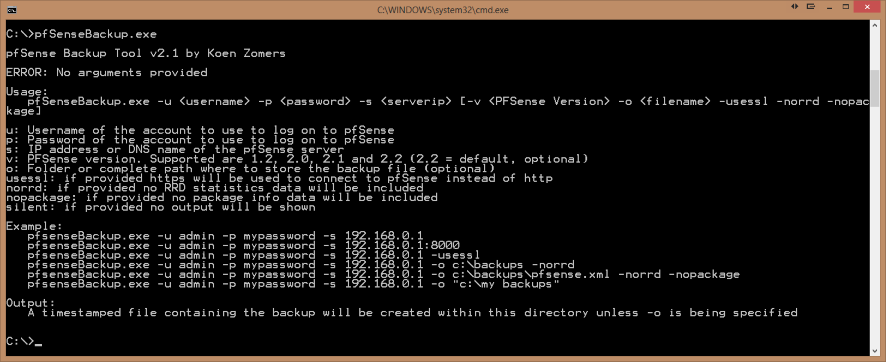

# pfSenseBackup
pfSense Backup allows you to backup the complete configuration of your pfSense server using this command line Windows application. It is easy to include this in a larger script for your backups and schedule it i.e. with the Windows Task Scheduler.

## Download

[Download the latest version](https://github.com/KoenZomers/pfSenseBackup/raw/master/Releases/pfSenseBackupv2.1.zip)

## Release Notes

2.1 - released June 28, 2015 - [download](https://github.com/KoenZomers/pfSenseBackup/raw/master/Releases/pfSenseBackupv2.1.zip) - 10 kb

- Usernames and passwords sent to pfSense will now first be UrlEncoded. This allows usernames and passwords to be used with special characters like the + sign. Thanks to Marc Mittelman for pointing out this issue!
- Retargeted the .NET Framework to v4.0 as v2.0 to which it was set before isn't shipped by default anymore on modern Windows client & server operating systems

[Version History](https://github.com/KoenZomers/pfSenseBackup/blob/master/VersionHistory.md)

## Usage Instructions

1. Copy pfSenseBackup.exe to any location on a Windows machine where you want to use the tool
2. Run pfSenseBackup.exe to see the command line options
3. Run pfSenseBackup.exe with the appropriate command line options to connect to your pfSense server and download the backup

## Feedback

Any kind of feedback is welcome! Feel free to drop me an e-mail at mail@koenzomers.nl